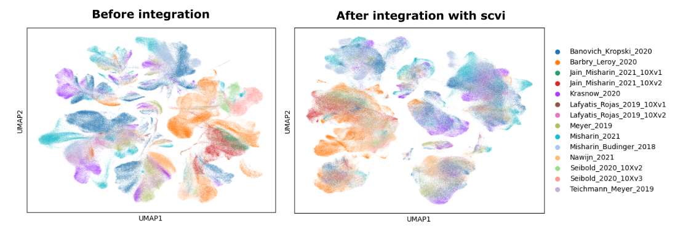
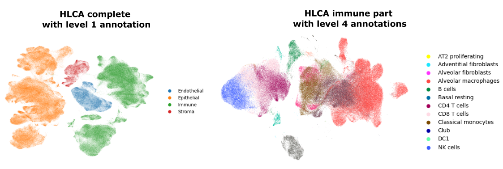
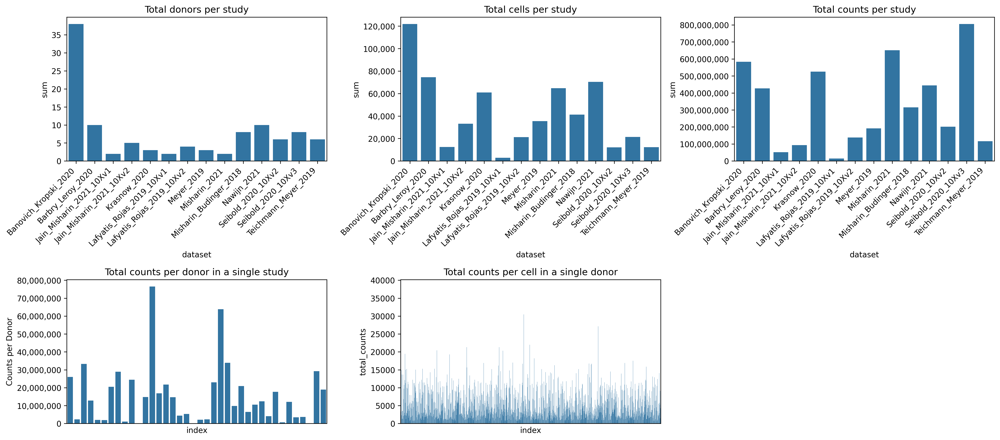
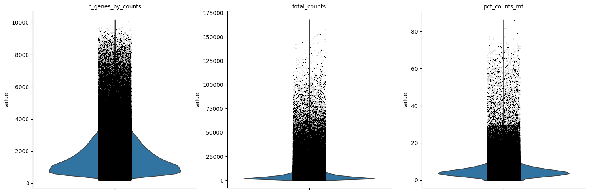
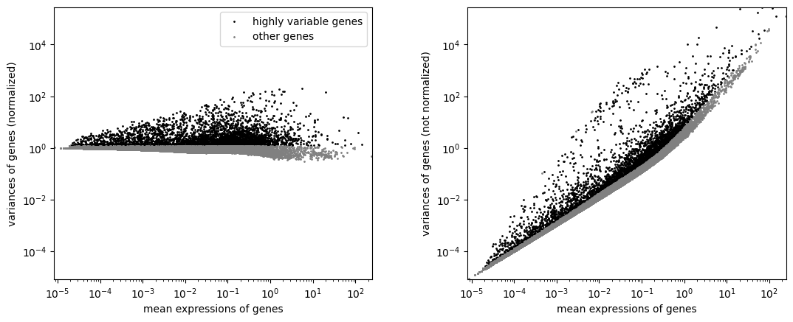

# Exploring the Integration of Single-Cell RNA Sequencing Datasets: Human Lung Cell Atlas (HLCA)

This project is an in-depth exploration of the integration of multiple single-cell RNA sequencing (scRNA-seq) datasets, inspired by the [Human Lung Cell Atlas (HLCA)](https://doi.org/10.1038/s41591-023-02327-2) study published in *Nature Medicine* last year. The HLCA successfully integrated 49 datasets, representing data from 49 independent studies, into a unified atlas, enabling unprecedented insights into lung cell biology.

In this repository, we focus on understanding and reproducing the integration process of the core HLCA dataset, which comprises 13 datasets and approximately 600,000 cells from healthy lung scRNA-seq studies. This exploration emphasizes how different decisions in preprocessing, normalization, batch-effect correction, clustering, and annotation affect the resulting integrated dataset.

## Current Explorations

**Figure 1. Batch effect correction with SCVI aligns cell types across datasets.** The left panel shows a UMAP of 13 single-cell RNA sequencing datasets before batch effect correction, where cells are grouped by dataset (batch) rather than cell type, revealing significant batch effects. The right panel shows the same data after scvi-based integration, where cells cluster by cell type, with minimal influence from dataset-specific batch effects.

**Figure 2. Human Lung Cell Atlas clustering and annotation.**  The left panel shows the complete Human Lung Cell Atlas core annotated with level 1 categories. The right panel focuses on the immune subset of the atlas, after nested clustering, annotated with level 4 categories, including CD8 T-cells, CD4 T-cells, and NK cells. 

**Figure 3.** Dataset variability in the HLCA core. Analysis of 13 datasets revealed substantial differences in sample sizes, library counts, and sequencing chemistries (e.g., 10X Genomics v2 vs. v3). These variations highlight challenges in normalizing and correcting for library size differences.

**Figure 4.** Quality control and selection of highly variable genes.

---

## Methodology

The project leverages the raw matrices, metadata, and code provided by the HLCA study. The analysis is implemented in Python, using **Polars** for handling tabular data and **Scanpy** for single-cell analysis workflows. The computations are performed in a **Jupyter Notebook** environment, running on a remote Linux server equipped with an NVIDIA 4090 GPU.

---

## Progress and Status

This project is a work in progress, and the current focus is on:

- **Reproducing** the construction of the core HLCA dataset.
- **Implementing** initial comparisons of normalization, batch-effect correction, and clustering results.
- **Expanding** the analysis to explore more recent integration or interpretability techniques.

---

## Contributions and Learning Goals

This project is aimed at enhancing understanding and accessibility of large-scale scRNA-seq dataset integration for both personal learning and the broader research community. Contributions, discussions, and collaborations are welcome to refine and expand this exploration.

---
